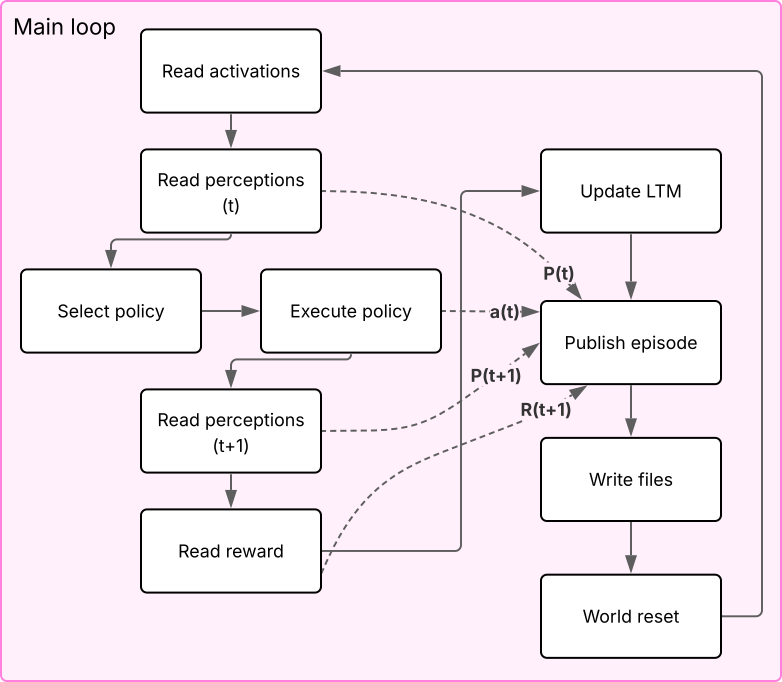
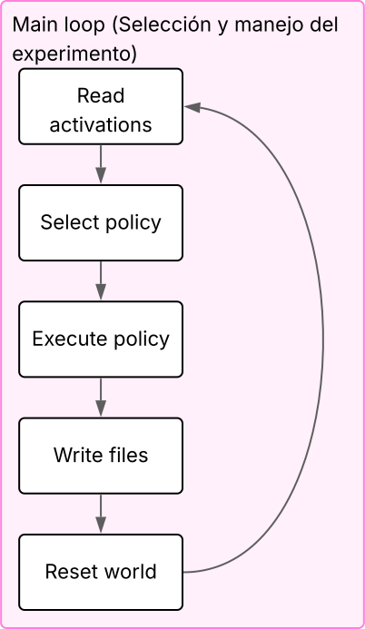
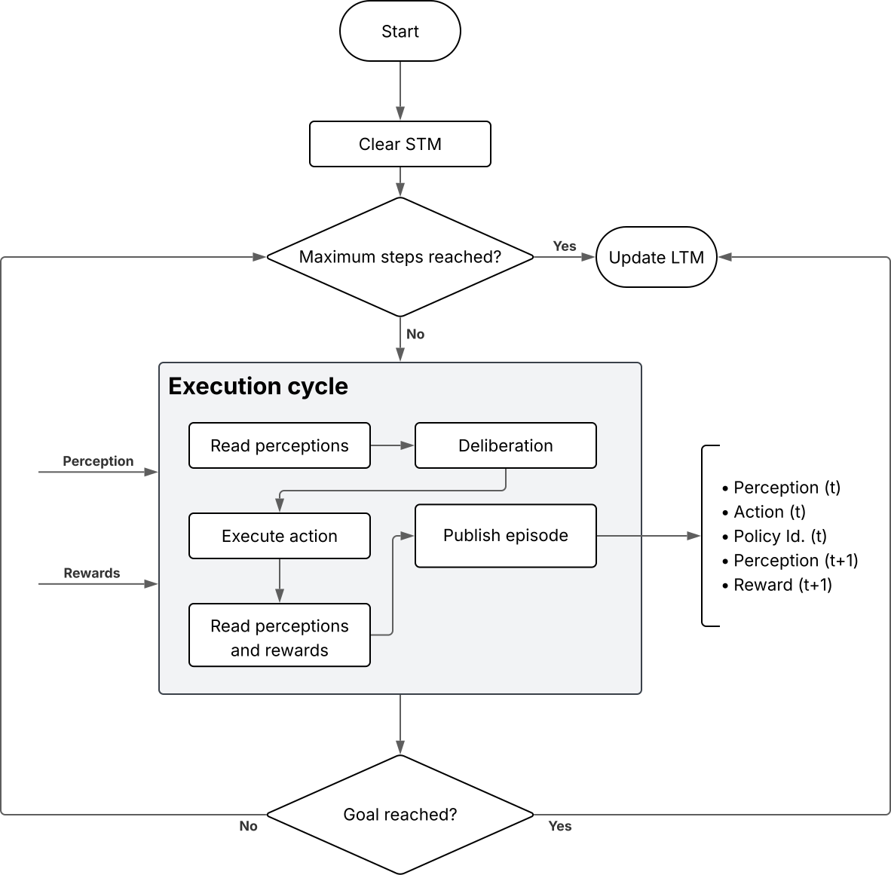

This is part of the e-MDB architecture documentation. Main page [here](https://docs.pillar-robots.eu/en/latest/).

# e-MDB reference implementation for cognitive processes

This [repository](https://github.com/pillar-robots/emdb_cognitive_processes_gii) includes software packages for the cognitive process that manipulate the knowledge elements in the Long-Term Memory (LTM) of the software implementation of the e-MDB cognitive architecture developed under the [PILLAR Robots project](https://pillar-robots.eu/).

Cognitive processes reads perceptions, calculate an activation value for each knowledge nugget (node) depending on those perceptions and the activation of the connected nodes, and, finally, it executes an action [^1].

Currently, there are two implementations of the **main cognitive loop** process. One is a centralized version that includes perception, goal and episode handling (this is the legacy behavior). A lightweight version has been implemented that only performs high level decision. This newer version is used with the **deliberation** cognitive process, which is instantiated inside of Utility Models and handles perceptions, rewards and LTM updates.

The behavior of the legacy Main Loop can be seen in the following diagram:

<div style="width:100%; margin:auto; text-align:center;">



*Legacy Main Loop behavior*
</div>

The behavior of the lightweight Main Loop can be seen in the following diagram:

<div style="width:100%; margin:auto; text-align:center;">



*Lightweight Main Loop behavior*
</div>

The behavior of the deliberation process can be seen in the following diagram:

<div style="width:100%; margin:auto; text-align:center;">



*Deliberation process behavior*
</div>


<!-- More cognitive processes will come, as those related to learning processes, necessary to generate and adapt world models, utility models, and policies. -->

In the section [Main Loop API Documentation](cognitive_processes/main_loop.rst) you can find the API documentation of the different processes.

[^1]: Duro, R. J., Becerra, J. A., Monroy, J., & Bellas, F. (2019). Perceptual generalization and context in a network memory inspired long-term memory for artificial cognition. _International Journal of Neural Systems, 29(06)_, 1850053.

```{toctree}
:caption: e-MDB Cognitive processes
:hidden:
:glob:

cognitive_processes/*
```